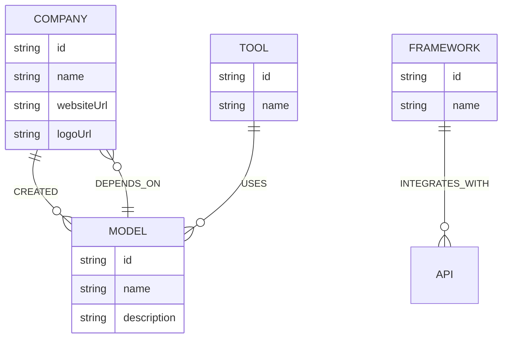

# AI Nexus

**The definitive knowledge graph of the AI ecosystem.**

AI Nexus is a modern, canvas-first graph exploration platform that allows researchers, engineers, and product managers to map and understand the rapidly evolving artificial intelligence ecosystem. By visualizing connections between Companies, Models, Frameworks, and Tools, AI Nexus provides a bird's-eye view of how the industry operates and integrates.

---

## 🎯 Product Overview

Unlike traditional dashboard applications, AI Nexus uses a **Canvas-First** design philosophy. The graph is the product.

Inspired by tools like Excalidraw, Figma, and Raycast, the application drops users immediately into an interactive WebGL visualization, providing powerful tools to navigate deeply complex relationships without the clutter of heavy sidebars and menus.

### Key Features
- **Immersive WebGL Graph**: A high-performance physics-based node simulation (powered by `react-force-graph-2d` and `d3-force`) capable of rendering thousands of nodes and edges smoothly.
- **N-Hop Neighbor Exploration**: Dynamically expand a node's ecosystem by visualizing its 1-hop, 2-hop, or 3-hop connections in real-time.
- **Shortest Path Explorer**: Select any two nodes in the ecosystem (e.g., `Cursor` and `Stripe API`) and the application will traverse the graph to find the shortest integration path connecting them.
- **Smart Global Search**: A fast, keyboard-accessible command palette (`Cmd + K`) that instantly searches the graph and highlights the target node.
- **Dynamic Context Panels**: Click on any node to slide out a comprehensive information drawer containing its metadata, official logo, and a breakdown of incoming/outgoing dependencies.
- **Automatic Logo Resolution**: Integrated with the Clearbit Logo API to automatically fetch and display official company/tool logos based on their website domain.

---

## 🎯 Use Case & Why a Graph Database?

### The Problem
The AI landscape is moving too fast. Keeping track of which models power which tools, which frameworks integrate with which APIs, and which companies own which technologies is nearly impossible using traditional relational databases or static lists.

### The Solution: Native Graph Architecture (Neo4j / CognoDB)
AI Nexus is built entirely on **Neo4j** (managed via CognoDB). We chose a native graph database because the ecosystem is heavily interconnected.
- **Relational vs. Graph**: A SQL database would require expensive, deeply nested `JOIN` operations to figure out "How is Cursor connected to Stripe?". In a graph database, relationships are first-class citizens. We can traverse 6 hops across the industry in milliseconds.
- **Schema Flexibility**: As new AI paradigms emerge, adding new nodes (e.g., `Agent`) or relationships (`REPLACES`, `AUGMENTS`) is trivial in a graph model, requiring no rigid schema migrations.

---

## 📊 Data Model

The Neo4j database uses a straightforward semantic schema:



**Nodes** are tagged with Labels (e.g., `:Company`, `:Model`, `:Tool`, `:Framework`).
**Edges** represent relationships (e.g., `:USES`, `:INTEGRATES_WITH`, `:CREATED_BY`) and carry a `reason` property explaining exactly *why* the connection exists.

---

## 🏗️ Architecture & Tech Stack

AI Nexus is built using a modern, scalable, and type-safe stack:

**Frontend (Client)**
- **Framework**: Next.js 15 (App Router)
- **Language**: TypeScript
- **Styling**: Tailwind CSS v4 & shadcn/ui
- **State & Data Fetching**: React Query & React Context API
- **Visualization**: `react-force-graph-2d` (HTML5 Canvas / WebGL)

**Backend & Database**
- **API**: Next.js Route Handlers
- **Database**: Neo4j (via CognoDB)
- **Driver**: `neo4j-driver`
- **Query Language**: Cypher

---

## 🔌 API Documentation (Route Handlers)

The Next.js backend acts as a secure proxy to the Neo4j database, exposing the following REST API routes:

| Endpoint | Method | Query Params | Description |
|---|---|---|---|
| `/api/search` | `GET` | `?q=<string>` | Full-text fuzzy search across node names and descriptions. |
| `/api/nodes/[id]` | `GET` | - | Returns full metadata for a specific node, including all 1st-degree incoming and outgoing edges with relationship context. |
| `/api/graph/neighbors` | `GET` | `?nodeId=<id>&depth=<num>` | Traverses the graph from the source node up to N-hops and returns the localized subgraph (nodes and edges). |
| `/api/graph/path` | `GET` | `?source=<id>&target=<id>` | Calculates the shortest relationship path between two nodes (up to 6 hops) and returns the traversal steps. |
| `/api/graph/similar` | `GET` | `?nodeId=<id>` | Finds "Similar Tools" by calculating nodes that share the highest number of common dependencies. |
| `/api/graph/stats` | `GET` | - | Aggregates the total number of nodes, relationships, and category breakdowns across the entire Neo4j database. |

---

## 🔌 Core Graph Queries (Cypher)

The real power of AI Nexus lies in its Cypher queries. Here is how the backend resolves complex data:

### 1. Global Search (Fuzzy Match & Rank)
We search nodes and dynamically rank them based on whether they are an exact match, prefix match, or description match.
```cypher
MATCH (n)
WITH n,
     CASE 
       WHEN toLower(n.name) = toLower($query) THEN 1
       WHEN toLower(n.name) STARTS WITH toLower($query) THEN 2
       WHEN toLower(n.name) CONTAINS toLower($query) THEN 3
       WHEN toLower(n.description) CONTAINS toLower($query) THEN 4
       ELSE 5
     END AS rank
WHERE rank <= 4
RETURN n.id, labels(n)[0] AS label, n.name, n.logoUrl, rank
ORDER BY rank ASC, n.name ASC
LIMIT 20
```

### 2. N-Hop Neighborhood Expansion
When a user clicks "Explore", we fetch all surrounding nodes up to a specific depth (e.g., 2 or 3 hops).
```cypher
MATCH path = (start {id: $id})-[*1..2]-(neighbor)
UNWIND nodes(path) AS n
UNWIND relationships(path) AS r
RETURN collect(DISTINCT n) AS nodes, 
       collect(DISTINCT {
         type: type(r),
         reason: r.reason,
         source: startNode(r).id,
         target: endNode(r).id
       }) AS edges
```

### 3. Shortest Path Explorer
The graph traversal engine finds the most efficient connection between any two disjointed tools (up to 6 hops).
```cypher
MATCH path = shortestPath((source {id: $sourceId})-[*..6]-(target {id: $targetId}))
RETURN [node in nodes(path) | node] AS nodes,
       [rel in relationships(path) | {
         type: type(rel),
         reason: rel.reason,
         source: startNode(rel).id,
         target: endNode(rel).id
       }] AS edges
```

---

## 🚀 Local Setup & Demo Environment

To run AI Nexus locally, you will need Node.js and access to a Neo4j instance. 

### 1. Get a CognoDB / Neo4j Instance
You can spin up a free managed graph database instantly:
1. Go to [Neo4j Aura](https://neo4j.com/cloud/aura/) or your CognoDB provider.
2. Create a new Free Tier database instance.
3. Save the generated `Connection URI` (usually starting with `bolt+s://`), `Username` (usually `neo4j`), and `Password`.

### 2. Clone & Install
```bash
git clone <repository-url>
cd ai-nexus
npm install
```

### 3. Environment Variables
Create a `.env.local` file in the root directory and add your credentials:
```env
NEO4J_URI=bolt+s://db-your-id.databases.cognodb.com
NEO4J_USER=cognodb
NEO4J_PASSWORD=your_secure_password
```

### 4. Seed the Database
AI Nexus includes a powerful seeding script that populates your blank CognoDB instance with hundreds of nodes and relationships representing the current AI ecosystem.
```bash
npm run seed
```
*(Optional)*: To fetch and inject the latest website domains for official Clearbit logos:
```bash
npx tsx --env-file=.env.local scripts/add-websites.ts
```

### 5. Run the Application
Start the Next.js development server:
```bash
npm run dev
```
Open [http://localhost:3000](http://localhost:3000) in your browser. The application defaults to Light Theme, with an ultra-minimal, canvas-first interface.
